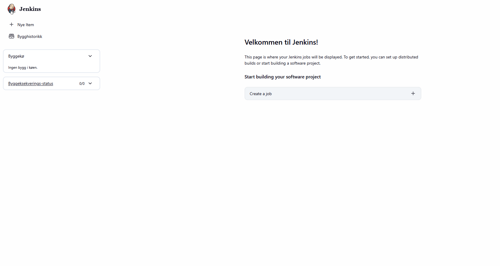
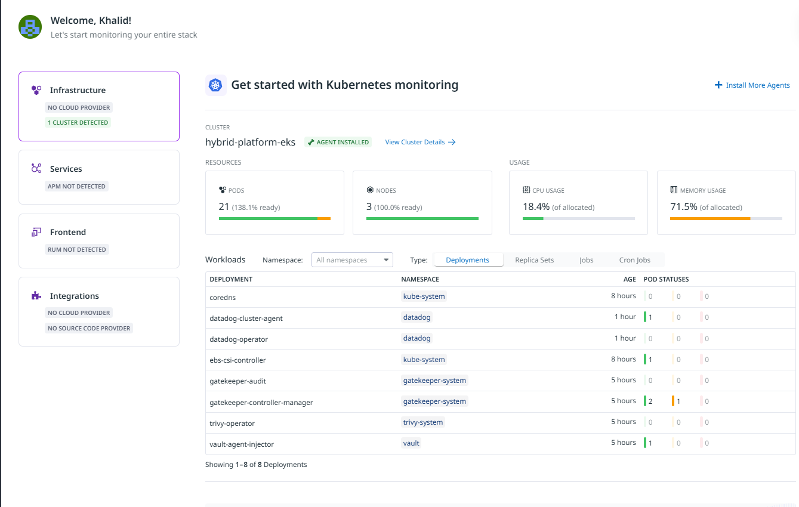
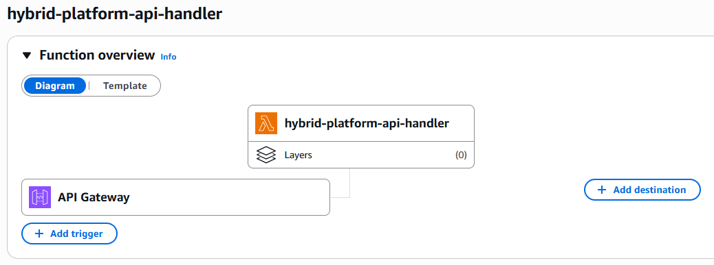
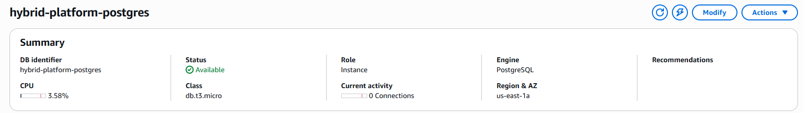
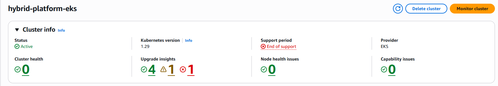

# AWS Hybrid Platform

A production-grade hybrid platform mixing EKS containerised workloads with Lambda serverless functions, built to demonstrate senior-level DevOps engineering on AWS.

**Live API:** `https://pkzpdsbjya.execute-api.us-east-1.amazonaws.com/dev/hello`

---

## Tech Stack

| Category | Tool |
|---|---|
| CI/CD | Jenkins (on EKS) |
| IaC | Terraform |
| Cloud | AWS (EKS, Lambda, S3, RDS, ECR) |
| Containers | Docker + Kubernetes (EKS) |
| Security | Trivy + OPA/Gatekeeper |
| Secrets | AWS Secrets Manager + HashiCorp Vault |
| Monitoring | Datadog |
| Networking | AWS VPC + Calico CNI |

---

## Jenkins CI/CD on EKS



Jenkins runs as a pod inside the EKS cluster, accessible via AWS Load Balancer. Pipelines automate build, scan, and deploy on every push to main.

---

## Datadog Observability



Real-time metrics from the live EKS cluster showing 21 pods across all namespaces, 3 worker nodes at 100% ready, CPU and memory usage — all deployments visible including Jenkins, Vault, Trivy and Gatekeeper.

---

## Lambda — Serverless Functions



Two Lambda functions deployed via Terraform:

- **s3-processor** — triggered automatically on S3 file uploads
- **api-handler** — HTTP endpoint via API Gateway

Live response:
```json
{
  "message": "Hello from AWS Lambda on EKS Hybrid Platform!",
  "timestamp": "2026-04-13T22:49:05.549Z",
  "project": "hybrid-platform"
}
```

---

## Data Layer



RDS PostgreSQL deployed in private subnet — unreachable from the internet. Only accessible from within the VPC by EKS pods and Lambda functions. Credentials managed by HashiCorp Vault.

---

## Architecture



```
GitHub Repository
       │
       ▼
Jenkins CI/CD (on EKS)
  ├── Trivy image scanning
  ├── OPA/Gatekeeper policy enforcement
  └── Deploy to EKS + Lambda
       │
       ├── EKS Cluster (private subnet)
       │   ├── Jenkins
       │   ├── HashiCorp Vault
       │   ├── Trivy operator
       │   └── OPA Gatekeeper
       │
       ├── Lambda Functions
       │   ├── S3 event processor
       │   └── API Gateway handler
       │
       └── RDS PostgreSQL (private subnet)

AWS Secrets Manager + Vault | Datadog observability
```

---

## Infrastructure (Terraform IaC)

All AWS infrastructure defined as code. Single command deploys everything:

```bash
cd terraform/environments/dev
terraform init
terraform apply
```

Provisions: VPC with public/private subnets, EKS cluster, Lambda functions, API Gateway, S3 buckets, RDS PostgreSQL, ECR repository.

---

## Author

Khalid Hassan Osman